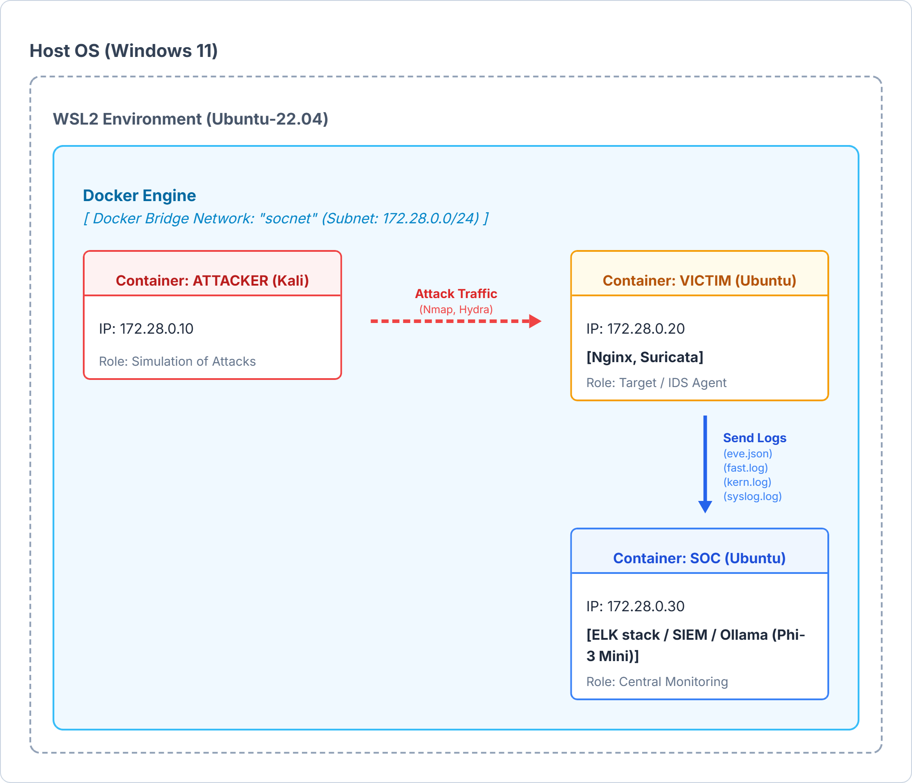
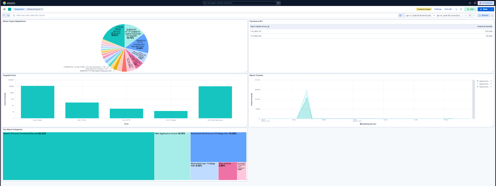

# Containerized SOC Lab: Threat Detection & AI-Powered Incident Response

A comprehensive, containerized Security Operations Center (SOC) laboratory environment built with Docker. This project simulates a complete cyberattack kill chain, implements network hardening, detects threats using an Intrusion Detection System (IDS), visualizes logs through a SIEM, and utilizes a local Large Language Model (LLM) for automated alert triage and correlation.

In this project, we built a fully functional, miniature **Security Operations Center (SOC)** from scratch to experience the complete Incident Response lifecycle. Our objective was not just to set up security tools, but to actively defend a network, execute a coordinated cyberattack, and analyze the aftermath.

**Project Scope & Methodology:**
1. **Built the Infrastructure:** We designed an isolated Docker network containing an Attacker node, a hardened Victim web server, and a centralized SOC monitoring station.
2. **Executed the Attack:** We launched a simulated kill chain against the Victim, starting with network reconnaissance (Nmap), escalating to web vulnerabilities scanning (Nikto), and culminating in a credential brute-force attack (Hydra).
3. **Monitored & Visualized:** We captured the malicious traffic using Suricata IDS and strict kernel-level firewall rules (`iptables` / `ulogd2`), routing all alerts to an ELK Stack (SIEM) to visually trace the attacker's steps in real-time.
4. **Introduced AI for Triage:** Finally, we extracted the raw security logs and fed them into a local Large Language Model (Phi-3 Mini). Our goal was to test if GenAI could successfully act as a Level 1 SOC Analyst—correlating the alerts, identifying the attack stages, and writing an incident report faster than a human.

This repository contains the complete infrastructure-as-code, configuration files, and documentation to replicate our SOC lab.

---

## Architecture Overview

The lab consists of three distinct isolated nodes operating on a custom Docker bridge network (`socnet` - `172.28.0.0/24`).



* **Attacker Node (Kali Linux - `172.28.0.10`):** Pre-configured with offensive security tools (Nmap, Nikto, Hydra) to simulate the attack kill chain.
* **Victim Node (Ubuntu - `172.28.0.20`):** The target system hosting an Nginx Web Server and SSH. Defended by strict `iptables` (Default DROP) and monitored by **Suricata IDS**. Kernel logs (NFLOG) are captured via `ulogd2`.
* **SOC Node (Ubuntu - `172.28.0.30`):** The centralized monitoring station hosting the **ELK Stack** (Elasticsearch, Kibana), **Filebeat** for log ingestion, and a local **Ollama** instance running the `Phi-3 Mini` LLM for automated alert correlation.
---

## Repository Structure & Data Persistence

To ensure data persistence (so logs and SIEM data are not lost when containers restart), this lab heavily utilizes Docker bind mounts. 

**Important:** Before running the lab, ensure your directory structure matches the tree below. The `data/` and `logs/` directories are mapped directly to the host machine. If they do not exist, Docker will automatically create them upon execution, but maintaining this structure is crucial for Filebeat to correctly ingest the Suricata logs.

```text
soc-lab/
├── docker-compose.yml
├── attacker/
│   └── Dockerfile
├── soc/
│   ├── Dockerfile
│   ├── config/          # Elasticsearch, Kibana, Filebeat YAML configs
│   └── scripts/         # Automated startup scripts
├── victim/
│   ├── Dockerfile
│   ├── config/          # Suricata YAML configuration
│   ├── rules/           # Custom Suricata IDS rules
│   └── scripts/         # Iptables hardening & startup scripts
├── data/                # Auto-generated: Persistent storage for Elasticsearch
└── logs/                # Auto-generated: Shared volumes for log routing
    ├── soc/             # ELK stack operational logs
    └── victim/          # Suricata (eve.json, fast.log) & iptables (syslog.log)
```
## Technologies Used
* **Infrastructure:** Docker, Docker Compose, WSL2 (Ubuntu 22.04)
* **Offensive Tools:** Nmap, Nikto, Hydra
* **Defensive & Monitoring:** Iptables (Stateful Firewall), Suricata IDS, ulogd2
* **SIEM / Data Pipeline:** Elasticsearch, Kibana, Filebeat
* **AI / ML:** Ollama, Phi-3 Mini (3.8B)

---

## Step-by-Step Installation & Execution

### Prerequisites
* Docker & Docker Compose installed.
* Ensure you allocate at least **8GB RAM** to your Docker Engine / WSL2 environment (via `.wslconfig`), as Elasticsearch and the local LLM require significant memory.

### 1. Clone the Repository
```bash
git clone https://github.com/EleniKechrioti/soc-incident-response-lab.git
cd soc-incident-response-lab
```

### 2. Build and Deploy the Environment
Bring up the entire SOC architecture using Docker Compose. The `-d` flag runs it in detached mode.
```bash
docker compose up --build -d
```

Verify that all three containers (`attacker`, `victim`, `soc`) are running:
```bash
docker ps
```

### 3. Verify SIEM Readiness
It takes about 30-60 seconds for Elasticsearch and Kibana to fully initialize. You can monitor the SOC node logs:
```bash
docker logs -f soc
```
Once initialized, access Kibana in your browser at: **http://localhost:5601**

---

## Simulating a Simple Attack (POC)

To generate traffic and alerts, execute the following commands from the `attacker` container.

**Access the attacker terminal:**
```bash
docker exec -it attacker /bin/bash
```

**1. Reconnaissance & Port Scanning (Nmap)**
```bash
nmap -sS 172.28.0.20
nmap -A 172.28.0.20
```

**2. Web Application Scanning (Nikto)**
```bash
nikto -h http://172.28.0.20
```

**3. Credential Access / SSH Brute-Force (Hydra)**
```bash
printf "1111\n2222\n3333\n4444\n5555\n6666\ntoor\n" > passwords.txt
hydra -l root -p passwords.txt ssh://172.28.0.20
```

---

## Threat Detection & SIEM Visualization

As the attacks are executed, Suricata and the firewall generate logs (`eve.json`, `syslog.log`, `fast.log`) which are ingested by Filebeat and visualized in Kibana.

### Kibana Dashboards


The SOC dashboard effectively visualizes:
* **Attack Types (Signatures):** Noise-filtered pie charts identifying Brute Force, Web Scans, and SQL Injection attempts.
* **Targeted Ports:** Clear identification of targeted services (Port 80 HTTP, Port 22 SSH) excluding ephemeral ports.
* **Attack Timeline:** Spikes in network traffic correlating perfectly with the execution of Nmap, Nikto, and Hydra.

### Sample Alert (Suricata `eve.json`)
Below is a sample JSON alert generated by Suricata during the SSH Brute-Force attack, captured by our custom rule:

```json
{
  "timestamp": "2026-04-16T07:38:17.118585+0000",
  "event_type": "alert",
  "src_ip": "172.28.0.10",
  "src_port": 60328,
  "dest_ip": "172.28.0.20",
  "dest_port": 22,
  "proto": "TCP",
  "alert": {
    "action": "allowed",
    "signature_id": 1000007,
    "signature": "LOCAL Possible SSH brute-force / repeated connection attempts",
    "severity": 3
  }
}
```

---

## AI-Powered Alert Triage

One of the most advanced features of this lab is the integration of a **Local Large Language Model (LLM)** to act as an automated Level 1 SOC Analyst. Instead of manually correlating thousands of raw log lines, the system uses AI to accelerate the initial triage process and map out the attack kill chain.

### Implementation & Overcoming Constraints
* **Engine & Model:** We deployed **Ollama** running the **Phi-3 Mini (3.8B)** model directly inside the SOC container. This ensures 100% data privacy (no logs ever leave the lab environment). Phi-3 was specifically chosen because larger models (like Llama 3) exceeded the memory limits of our WSL2 environment and caused crashes.
* **Data Processing (Chunking):** Raw SIEM and IDS logs (`eve.json`, `syslog.log`) are massive and exceed standard LLM context windows. To solve this, we implemented a data preparation pipeline: we filtered only critical alerts using `jq` and fed them to the model in manageable chunks of ~200 lines.

### The SOC Analyst Prompt
The model was initialized with the following context to guide its behavior:
> *"Ok, imagine you are a SOC analyst. I will provide you with IDS (Suricata), SIEM, and firewall logs from a simulated attack. Your task is to correlate the alerts, identify attack stages, and produce a structured incident analysis including timeline, attack techniques, and indicators of compromise. Here are the logs: ..."*

### AI Output & Evaluation
The LLM successfully processed the chunks and identified the complete attack kill chain:
1. **Reconnaissance:** ICMP pings.
2. **Scanning & Enumeration:** Nmap Port Scans & Service Detection.
3. **Web Application Attacks:** Nikto HTTP probing.
4. **Credential Access:** Hydra SSH Brute-Force.

**Sample LLM Output Excerpt:**
```text
Incident Summary: The full incident timeline shows multiple web application attacks, port scanning activities potentially leading up to an unauthorized access attempt on a remote server (172.28.0.20). These events are spread across different times but exhibit patterns consistent with pre-attack reconnaissance and brute force attempts...
```

**Human vs. AI Conclusion:** While the LLM proved to be incredibly fast at spotting trends and extracting generic Indicators of Compromise (IoCs), human verification remains essential. The model occasionally struggled with formatting and minor contextual misinterpretations (e.g., confusing Telnet mapping signatures with actual SSH brute force). It serves as a powerful triage assistant, but cannot yet fully replace a human analyst's precise correlation skills.

---

## Teardown
To safely stop and remove the containers, networks, and preserve the data volumes:
```bash
docker compose down
```
To remove everything including the persistent data volumes:
```bash
docker compose down -v
```
